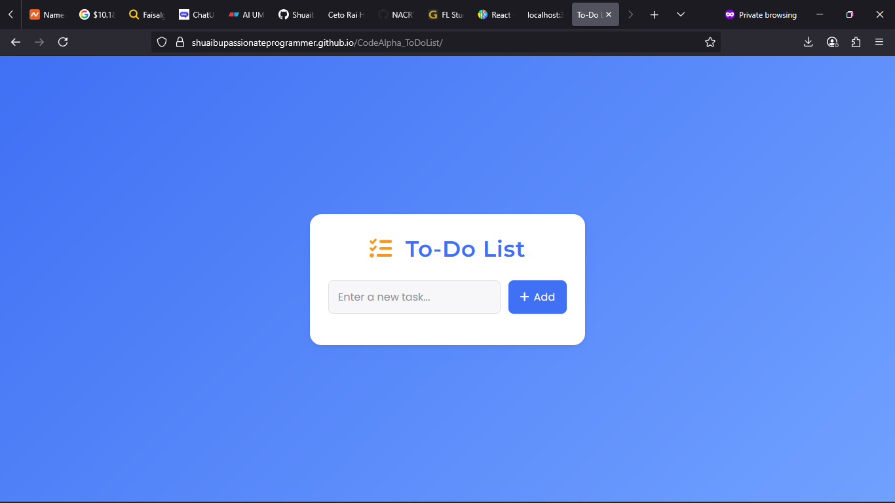

# 📝 To-Do List App

This project is part of my **CodeAlpha Web Development Internship**.

The To-Do List is a web application for managing daily tasks. It supports adding, editing, deleting, and marking tasks as complete. Tasks are also saved in **localStorage** for persistence.

---

## 🚀 Live Demo
🔗 [View To-Do List](https://yourusername.github.io/CodeAlpha_ToDoList/)

---

## 📂 Features
- Add new tasks
- Edit tasks
- Delete tasks
- Mark tasks as completed
- Persist tasks using **localStorage**

---

## 🛠️ Tech Stack
- **HTML** – structure  
- **CSS** – layout & styles  
- **JavaScript** – task logic and CRUD operations  

---

## 📸 Screenshot

---

## 📚 What I Learned
- **CRUD operations in JavaScript**  
- **Event handling** (click, submit)  
- Using **localStorage** for saving data  
- Building responsive and interactive UIs  

---

## 📝 Author
👤 [Ibrahim Shuaibu Isa](https://www.linkedin.com/in/shuaibu-ibrahim-76970b279/)  
📧 ibrahimshuaibuisa7@gmail.com